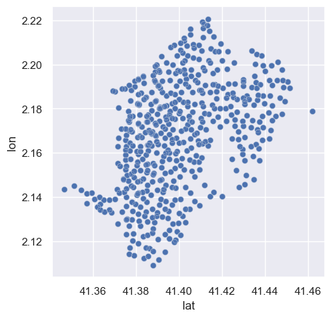
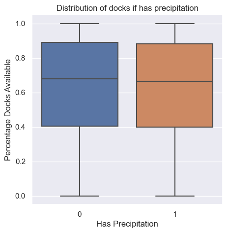
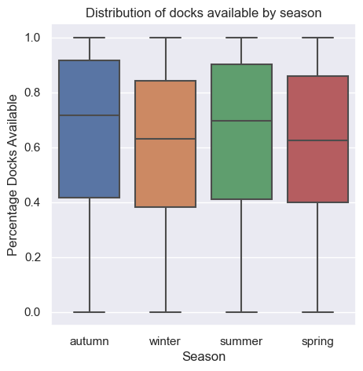
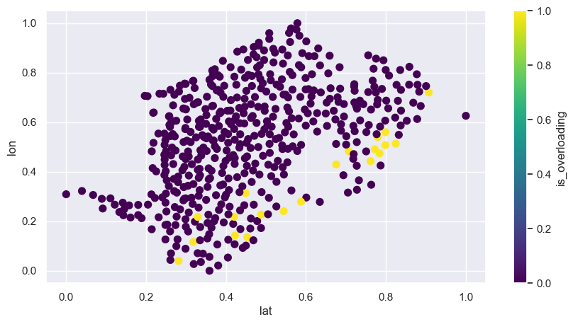
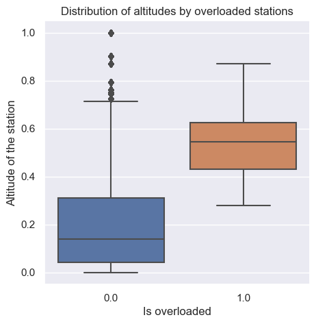

# Bike Sharing Prediction

We aim to be predicting the percentage of docks available in the different bike stations in Barcelona.
For this, the initial dataset provided is from **OpenData Ajuntament de Barcelona**, and will take the years
2019-2023 and all the months.

### Team

- Sana Amazian (Kaggle: sanaamazian)
- María Tenorio (Kaggle: maratenorio) 
- Nil Andreu (Kaggle: nilandreu) 

### Data Gathering

We have added additional data to the initial bicing one.

1. **Station Information**: which included the altitude, longtitude and lattitude of the stations. 
This information was interesting to then identify areas of common bicing usage, as  well as areas where the use as overloaded.

2. **Covid Cases**: the amount of covid cases as well as the dates in which there was confinment.

3. **Weather Information**: the information about the precipitation, snow, wind speed.
In this case, we have not seen a clear relationship between the Y variable and this information.
Might have been too specific:

4. **Date Information**: based on the dates, we have extracted different information from the hour (morning, evening, ...),
but also from the day (weekday or weekend) as well as from the month (summer, ...). In this case, this information seemed
to have some relevant relationship:

5. **Local Festivities & holidays**: have added this information as well, but we had limitations on getting all the dates for all the years.

6. **Traffic**: the information of how much traffic it was in the city of Barcelona,

### Data Processing

We have cleaned the before dataset, as well as made the split between:
- train (2019-2022)
- val (2023 months 1-3)
- test (2023 month 4)

Also, we have done:
- **One-Hot Encoding**: substitute categorical values into a numerical array 
- Check every variable is an integer value
- **Min-Max Scaler**: range the variable to a [0, 1]

### Training

We have trained different models, from simpler to more complex:
- **Linear Regression**: as it had clear relationships between contexts and the Y variable (RMSE: 0.1154)
- **XGBoost**: to detect more complex relationships (RMSE: 0.1144)
- **Fully Connected NN**: detecting this way the most complex relationships (RMSE: 0.1157)

And the final model used at the end was an average of those predictions.

### What Affects Docks Available?

We have seen a very clear relationship between the location of the station and the predicted % of docks available.

Also, based on the following image, we can see that the south-west part of the Barcelona tend to have the higher percentage of docks available (the highest 20):

Moreover, we can see that the ones with less % of bikes available tend to be in zones of higher altitude:

So with those two important insights, is where we would recommend to add new stations.

### Notebook

Check the main notebook: [here](Biking%20Share%20Prediction.ipynb)

### Slides

The link to the slides [here](https://docs.google.com/presentation/d/1CbbK80YcYotNryyyY7KHxq_KAhLSS3Hx/edit?usp=sharing&ouid=100844763926110461990&rtpof=true&sd=true).

